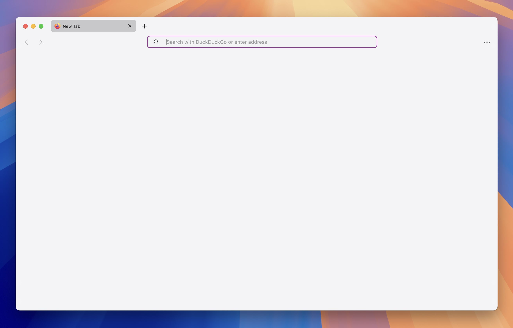
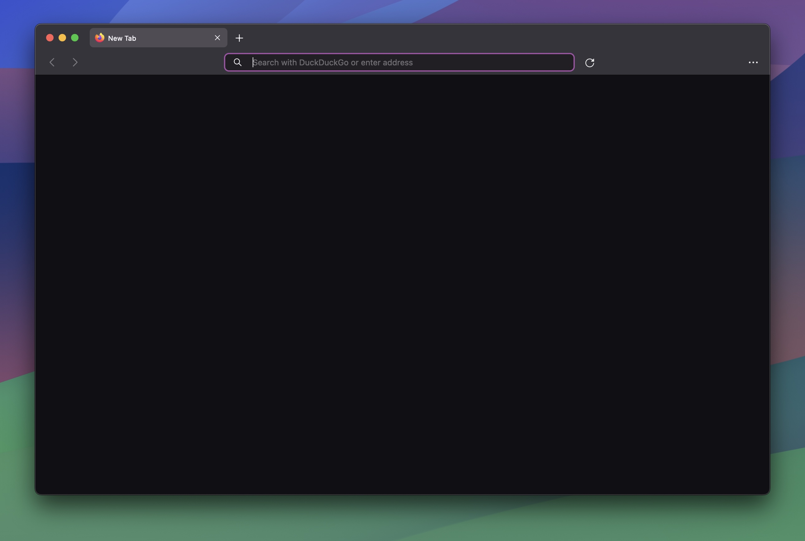

# 👋 Welcome to MacFox-Theme

## Safari like, minimalistic theme

Hi! I'm [d0sse](https://github.com/d0sse) and  this is Minimalist Mac - Safari-like - Firefox theme.

## Features

- Simple
- Light / Dark Version
- Now with automatic system accent color! 🎨

| Light Version* | Dark Version* |
|---|---|
|||

_**Note:** This setup looks best on macOS_

#### How to install

To start using MacFox, follow these steps:

1. Go to the following url address about:config
2. Ensure the following properties are set to true:

```
toolkit.legacyUserProfileCustomizations.stylesheets
svg.context-properties.content.enabled
layout.css.color-mix.enabled
browser.theme.native-theme
```

3. Go to the following url address about:support
4. Find "Profile Folder" section in the "Application Basics" list and copy the path (defined below as `$path`)
5. Open `terminal.app` and type:

```
cd $path
```

6. Type in the following command:

```
git clone <git@github.com>:d0sse/macFox-theme.git chrome
```

7. Restart Firefox to apply changes

Enjoy 🎉

Thanks!
