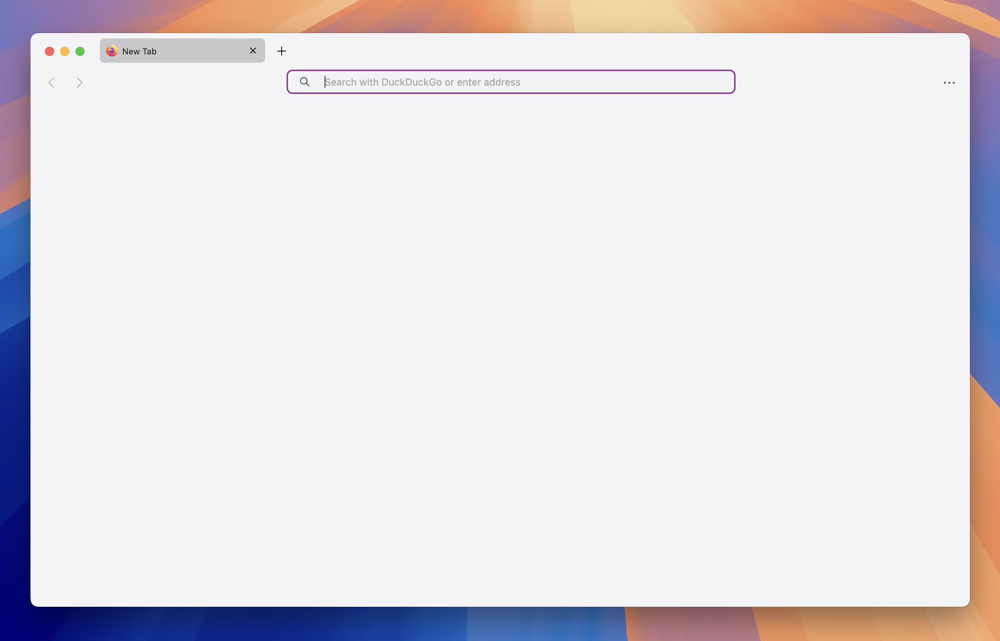
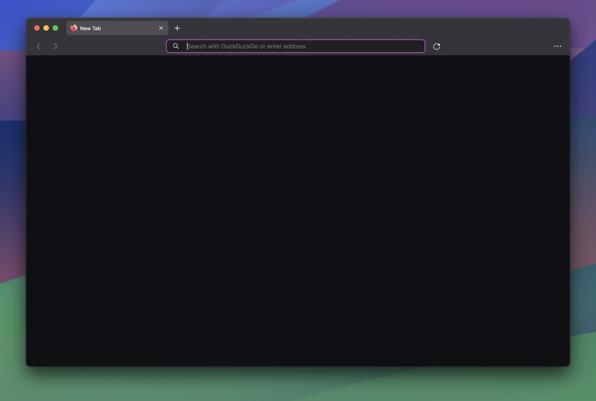
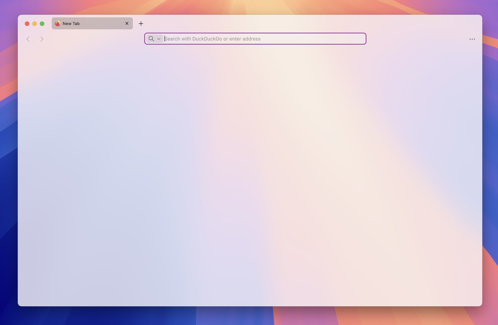
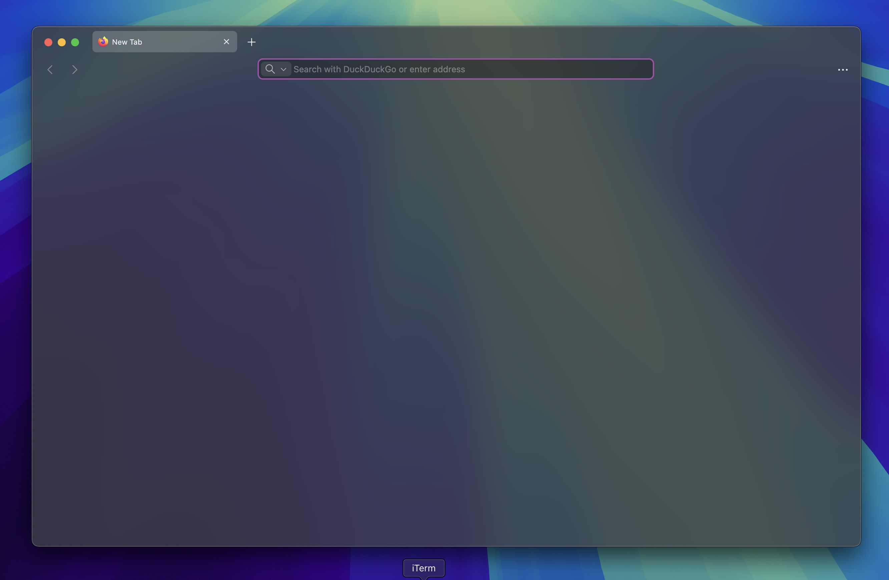
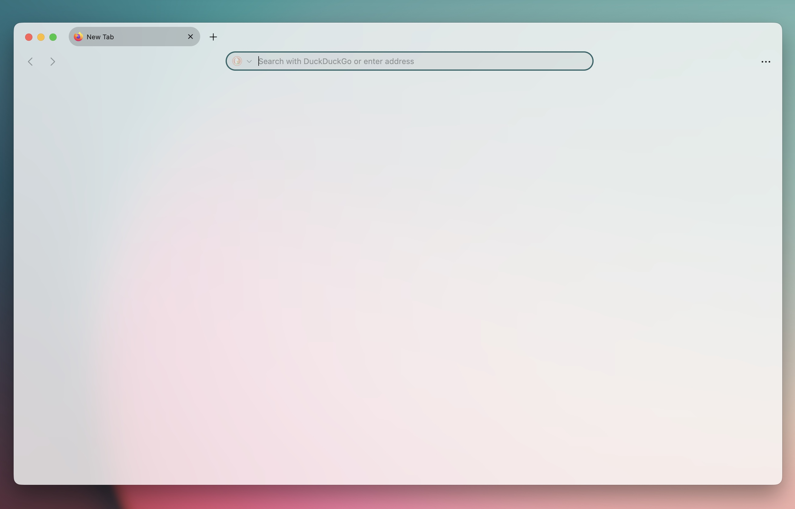
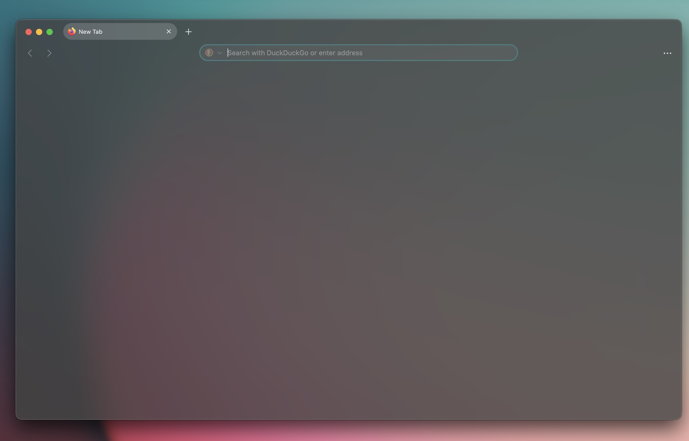

# 👋 Welcome to MacFox-Theme 🖥️🦊

### Now updated for Tahoe UI

## Safari like, minimalistic theme

Hi! I'm [d0sse](https://github.com/d0sse) and this is Minimalist Mac - Safari-like - Firefox theme.

> 🚀 **UPDATED FOR FIREFOX 153**

## Features

- Simple
- Light / Dark Version
- macOS Tint Background color
- Now with automatic system macOS accent color! 🎨
- 🎀 Compatible with [The Adaptive Tab Bar Color (ATBC)](https://github.com/easonwong-de/Adaptive-Tab-Bar-Colour)

| Light Version | Dark Version |
|---|---|
|||

| Light Transparent Version | Dark Transparent Version |
|---|---|
|||

| Tahoe Light Transparent Version | Tahoe Dark Transparent Version |
|---|---|
|||

> **WARNING**
> Tested Only on macOS!
---
> This theme is now **compatible with [Adaptive Tab Bar Color (ATBC)](https://github.com/easonwong-de/Adaptive-Tab-Bar-Colour)**.  

### How to install

To start using MacFox, follow these steps:

1. Go to the following url address `about:config`.
2. Ensure the following properties are set to `true`:

    ```text
    toolkit.legacyUserProfileCustomizations.stylesheets
    svg.context-properties.content.enabled
    browser.tabs.allow_transparent_browser
    layout.css.color-mix.enabled
    browser.theme.native-theme
    ```

3. If you want to enable the new UI for the closest match to Apple's macOS Tahoe design language, set this pref to `true`:

     ```text
    userChrome.tahoeUI.enabled
    ```

4. If you want enable macOS traslucent windows set to `true`:

    ```text
    widget.macos.titlebar-blend-mode.behind-window
    ```

5. If you want to disable the tab hover preview (the thumbnail card shown when hovering a tab), set this pref to `false`:

    ```text
    browser.tabs.hoverPreview.enabled
    ```

Then install the theme using **either** the quick script (recommended) or the manual steps below.

#### Option A — Install script (recommended)

1. Clone the repo anywhere and run the installer:

    ```bash
    git clone git@github.com:d0sse/macFox-theme.git
    cd macFox-theme
    ./install.sh
    ```

    The script auto-detects your default Firefox profile and copies the theme's
    CSS files into its `chrome` folder. To target a specific profile, pass its
    path: `./install.sh /path/to/profile`.

2. Apply `about:blank` for new windows and new tabs.
3. Fully restart Firefox (`Cmd+Q`, then reopen) to apply changes.

#### Option B — Manual

1. Go to the following url address `about:support`.
2. Find "Profile Folder" section in the "Application Basics" list and copy the path (defined below as `$path`).
3. Open `terminal.app` and type:

    ```bash
    cd $path
    ```

4. Type in the following command:

    ```bash
    git clone git@github.com:d0sse/macFox-theme.git chrome
    ```

5. Apply `about:blank` for new windows and new tabs.
6. Fully restart Firefox (`Cmd+Q`, then reopen) to apply changes.

## Privacy & Telemetry

For complete instructions on disabling all Firefox telemetry, pings, and communications to Mozilla servers, see:

➡️ [TELEMETRY.md](TELEMETRY.md)

Recommended Extensions

➡️ [EXTENSIONS.md](EXTENSIONS.md)

### Enjoy 🎉
