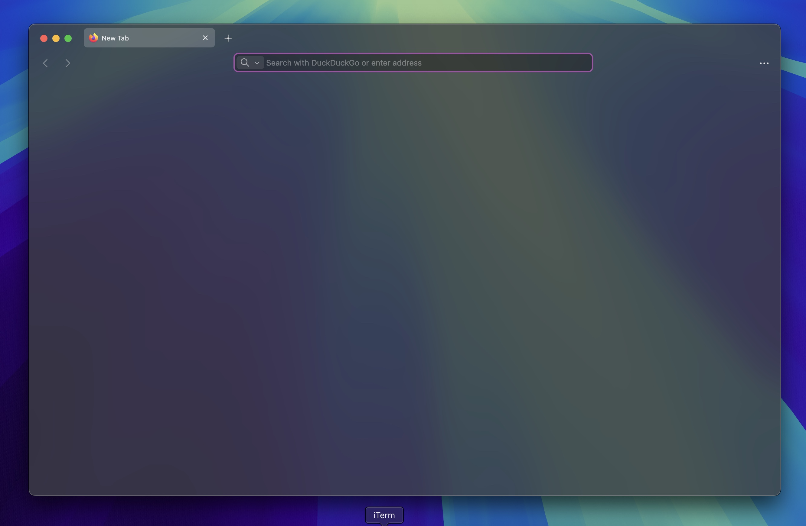

# 👋 Welcome to MacFox-Theme 🖥️🦊

## Safari like, minimalistic theme

Hi! I'm [d0sse](https://github.com/d0sse) and this is Minimalist Mac - Safari-like - Firefox theme.

> 🚀 **UPDATED FOR FIREFOX 141**

## Features

- Simple
- Light / Dark Version
- macOS Tint Background color
- Now with automatic system macOS accent color! 🎨

| Light Version | Dark Version |
|---|---|
|||

| Light Transparent Version | Dark Transparent Version |
|---|---|
|||

> **WARNING**: Tested Only on macOS!

### How to install

To start using MacFox, follow these steps:

1. Go to the following url address `about:config`.
2. Ensure the following properties are set to `true`:

    ```text
    toolkit.legacyUserProfileCustomizations.stylesheets
    svg.context-properties.content.enabled
    browser.tabs.allow_transparent_browser
    layout.css.color-mix.enabled
    browser.theme.native-theme
    ```

3. If you want enable macOS traslucent windows set to `true`:

    ```text
    widget.macos.titlebar-blend-mode.behind-window
    ```

4. Go to the following url address `about:support`.
5. Find "Profile Folder" section in the "Application Basics" list and copy the path (defined below as `$path`).
6. Open `terminal.app` and type:

    ```bash
    cd $path
    ```

7. Type in the following command:

    ```bash
    git clone git@github.com:d0sse/macFox-theme.git chrome
    ```

8. Apply `about blank` for New windows and new tabs.

9. Restart Firefox to apply changes.

### Enjoy 🎉
