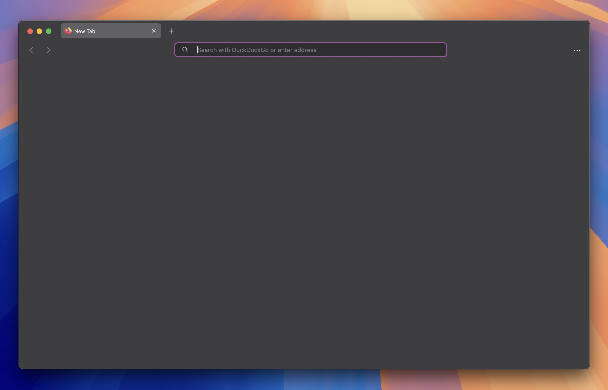

# 👋 Welcome to MacFox-Theme!
## Safari like minimalistic theme

Hi! I'm [d0sse](https://github.com/d0sse) and  this is Minimalist Mac - Safari-like - Firefox theme, based on **[firefox-macos-style](https://github.com/nchlscs/firefox-macos-style)** 

##Features 
- Simple
- Light / Dark Version 
- Now with automatic system accent color! 🎨

####Light Version 


####Dark Version


####How to install
To start using MaterialFox UPDATED, follow these steps:

1. Go to the following url address about:config
2. Ensure the following properties are set to true:
  	```
  	toolkit.legacyUserProfileCustomizations.stylesheets
	svg.context-properties.content.enabled
	layout.css.color-mix.enabled
	```
3. Go to the following url address about:support
4. Find Profile Folder and click Open Folder button
5. Go to the folder with the ternimal (on macOS drag the folder to `terminal.app`) 
6. Type in the following command:
	```
	git clone git@github.com:d0sse/macFox-theme.git chrome
	```
7. Restart Firefox to apply changes

Enjoy 🎉
